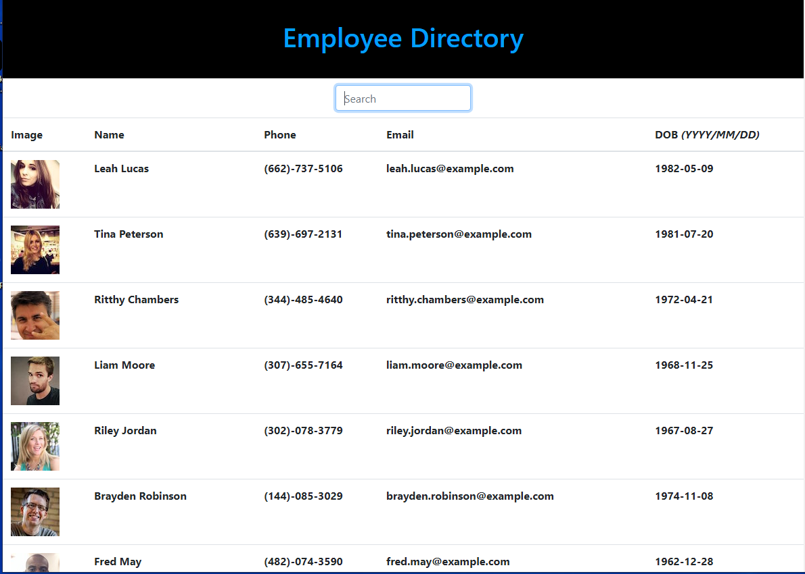
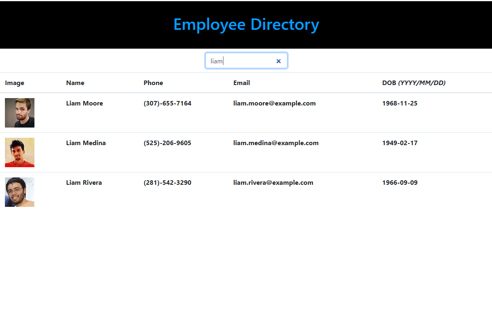

# Employee-Directory-React

## Table of Contents

- [Description](#Description)
- [Screen Shots](#Screen-Shots)
- [Technology Used](#Technology-Used)
- [License](#license)

## Deployed Site
 [Click Here ](https://zakfena.github.io/Employee-Directory-React/)

## Description

This a React app that uses axios to get random users and displays the users info in a table. It has a search function and a sort by name function. 

## Screen-Shots
,

## Technology-Used

- HTML
- CSS / BOOTSTRAP
- Javascript
- React
-Github

## License

## Question

If you have any questions please feel free to contact me.\
**Email:** zakfena@gmail.com\
**Git Hub** https://github.com/ZAKFENA
